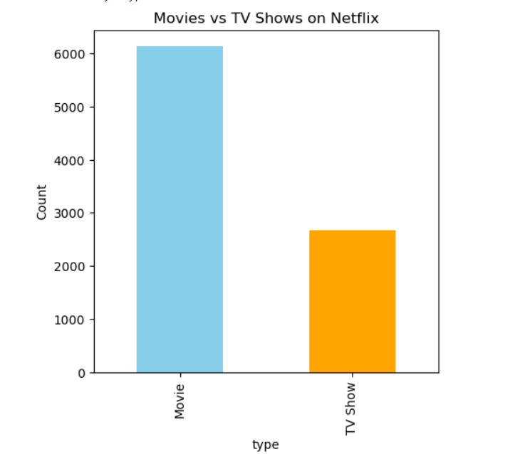
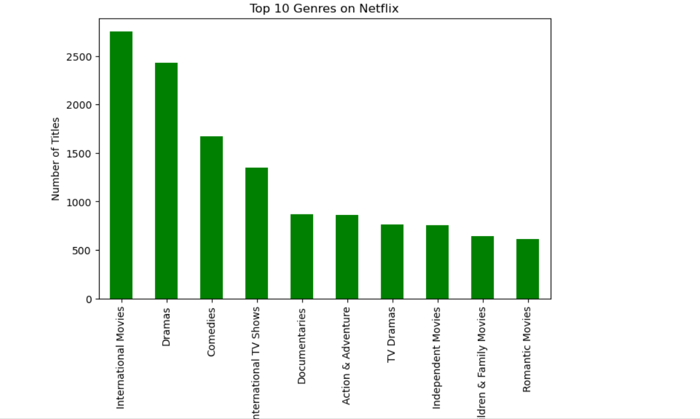
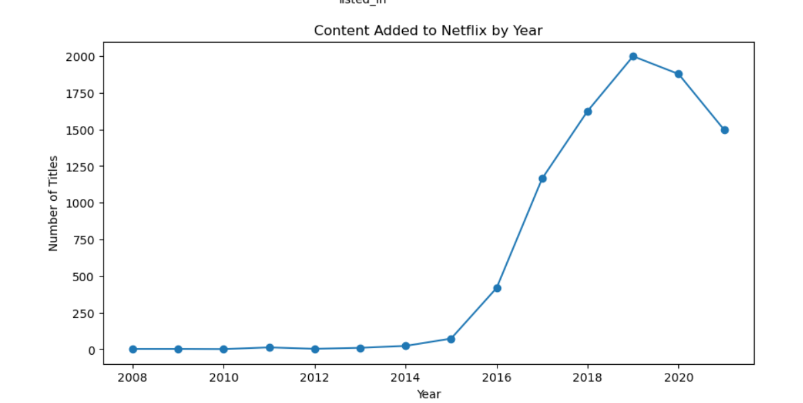

# Netflix Movies & TV Shows Analysis 🎬

## 📌 Project Overview
This project analyzes Netflix data to explore:
- Movies vs TV Shows count
- Most popular genres
- Content added per year

## 📊 Technologies
- Python
- Pandas
- Matplotlib

## 📂 Dataset
Dataset used: [Netflix Titles Dataset](https://www.kaggle.com/shivamb/netflix-shows)

## 📷 Sample Output



## 🚀 How to Run
```bash
jupyter notebook netflix_analysis.ipynb
